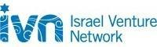

# Brand Deck — הג'וינט × IVN glassmorphism template

A reusable template for polished, animated HTML presentations in the organization's
visual identity: **light** glassmorphism, a disciplined blue→cyan palette taken from
the org logos, large readable Hebrew type, a running spotlight beam, choreographed
element reveals, mobile vertical-scroll, and A4 print. One HTML file, no build step.

## How to build a deck

1. **Copy the template.** Start from `template.html` in this skill folder — it holds
   the complete CSS + JS + three example slides (title / content / closing) and the
   4 partner logos in `logos/`. Copy it to the target location alongside a `logos/`
   folder, or (preferred) produce a **single self-contained file** by embedding the
   logos as data URIs (see "Self-contained output" below).
2. **Duplicate and fill slides.** Each slide is one `<section class="slide">…</section>`
   inside `<div class="deck">`. Add/remove sections freely — the JS auto-wires
   navigation, dots, and the progress bar from whatever `.slide` elements exist. The
   first slide must have `class="slide … active"`.
3. **Write the content** using the component snippets below. Keep the house rules
   (next section) — that's what keeps every deck looking like one system.
4. **Preview** by opening in a browser, or screenshot with headless Chromium to check
   layout before delivering.

## House rules (do not drift from these)

- **Palette lives in `:root`.** Never hard-code brand colors in slides — use the tokens
  (`--ivn-blue #0b6e9c`, `--joint-cyan #06bfd6`, `--navy`, `--azure`, `--sky`). The
  signature accent is the `--grad` blue→cyan gradient. To rebrand for another client,
  edit only the `:root` block.
- **Header pattern on every content slide:** a *small* section label top-right
  (`.eyebrow-top`, optionally with a gradient number badge `.ix`) + a *big* message
  title (`h2.head`) + a gradient rule (`.rule.rv-line`). The big title carries the
  punchy message; the small label carries the category/section/"אבן דרך N".
- **Large, readable type.** Body text ≥ ~15px, titles large. Don't shrink to fit —
  on mobile the deck scrolls (built in). Keep card paragraphs to ~3 lines.
- **RTL Hebrew** (`dir="rtl"`). Wrap standalone Latin/numeric tokens that must stay
  LTR in a span if bidi looks wrong; the `.ix` badge already isolates.
- **Spend boldness once per slide.** One signature element (the bridge, the funnel,
  the metric row) + quiet supporting cards. Don't stack many loud elements.
- **Motion is automatic.** Add `class="rv"` and `style="--d:NNN"` (ms) to stagger a
  block's entrance; use `.rv-line` for a rule that grows in. Keep delays ~70–120ms
  apart. The background beam, blob drift, and signal pulse are global — leave them.

## Component snippets (copy into a slide's `.wrap`)

**Slide header**
```html
<div class="shead rv" style="--d:0">
  <div class="eyebrow-top"><span class="ix">02</span>תווית הפרק</div>
  <h2 class="head">הכותרת הגדולה — המסר של השקף</h2>
  <span class="rule rv-line" style="--d:120"></span>
</div>
```
For a milestone slide use `<div class="eyebrow-top">אבן דרך 1</div>` (no `.ix`).

**Glass cards row** (tags: `t-navy t-blue t-azure t-cyan t-sky`)
```html
<div class="grid g3">
  <div class="glass card rv" style="--d:200"><span class="tag t-blue"></span>
    <div class="h">כותרת</div><p>טקסט קצר עם <b>הדגשה</b>.</p></div>
  <!-- g2 / g3 / g4 for 2/3/4 columns -->
</div>
```
Numbered pillar card: put `<div class="h"><span class="chip c-blue">2</span></div>`
then a `<div class="ct">כותרת</div>` and a `<p>`.

**Insight callout**
```html
<div class="insight rv" style="--d:460"><div class="ic">💡</div>
  <p><b>שורת תובנה:</b> משפט מסכם.</p></div>
```

**Metric row**
```html
<div style="display:flex;gap:clamp(24px,3.5vw,56px)">
  <div><div class="metric grad">5</div><div class="mlabel">תווית</div></div>
</div>
```

**Bullet list** (`mk` colors match chips)
```html
<ul class="blist">
  <li><span class="mk c-blue">1</span><span><b>ראש:</b> טקסט.</span></li>
</ul>
```

**Timeline table** — use `<table class="tl">` with `<thead>` + `<tbody>`; add
`class="key"` to highlight a row and `<span class="mile">` to color a milestone.
Rows cascade in automatically.

**Two-lane "bridge" signature** (great for gap/connection slides) and the **5-step
funnel** (`.funnel` with `.fstep`) — copy their markup from the full example deck
(see below); both are already styled.

**Title / closing** — wrap the slide content and add `<div class="frame rv"></div>`
as the first child for the cyan/blue corner frame. Title uses `h1.title`; the signal
dots are `<span class="signal"><span class="s1"></span><span class="s2"></span><span class="s3"></span></span>`.

**Partner logos**
```html
<div class="logos"><div class="logo-plate"></div>…</div>
```

**Presenter notes** — put speaker text in the slide's `data-notes="…"` attribute
(HTML allowed, escape quotes as `&quot;`). It shows in the bottom panel on `N`, never
on the projected slide.

## Behaviors already built in

- **Navigation:** ← → / space / PageUp-Down / Home-End; on-screen arrows; side dots;
  touch swipe. `N` = presenter notes, `F` = fullscreen.
- **Mobile (≤820px portrait):** each slide scrolls vertically, grids/funnel collapse
  to one column, type stays large. Landscape reverts to fit-to-screen.
- **A4 print:** `@media print` outputs A4 **landscape**, one slide per page, with
  backgrounds. Use the browser's Print / Save-as-PDF (enable "Background graphics").

## Self-contained output (recommended for delivery)

To ship one portable file with logos baked in, replace each `logos/*.png` src with a
data URI:
```python
import base64, re, pathlib
html = pathlib.Path("deck.html").read_text(encoding="utf-8")
for name in ["joint","ivn","edu","welfare"]:
    b64 = base64.b64encode(pathlib.Path(f"logos/{name}.png").read_bytes()).decode()
    html = html.replace(f"logos/{name}.png", f"data:image/png;base64,{b64}")
pathlib.Path("deck.html").write_text(html, encoding="utf-8")
```
Fonts (Rubik + Assistant, Hebrew + Latin) are already **embedded** in `template.html`
as `@font-face` data URIs, so decks render identically offline and in print with no
network. If you ever swap fonts, re-inline the woff2 the same way and drop the Google
Fonts `<link>`.

## Reference

A complete, real deck built with this template lives at repo root:
`mop-noar-presentation.html` (11 slides — hero, gap/bridge, goal, populations, 5-step
model, milestones, field stage, paths, Gantt, closing). Read it for full markup of the
bridge, funnel, and Gantt components.
